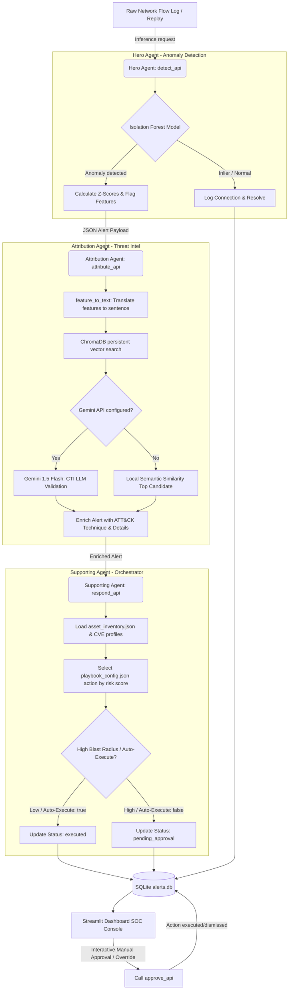

# SentinelMind AI — Cyber Resilience Platform
### Autonomous Multi-Agent Threat Detection, Attribution, and Gated Incident Response
**ET AI Hackathon 2026 — Problem Statement 7**

---

## 1. Executive Summary & Problem Statement

Modern enterprise networks are subject to increasingly complex, fast-moving cyber threats. Traditional static rule-based security systems fail to detect novel "zero-day" anomalies and lack the context to understand the threat tactic or coordinate appropriate mitigation. 

**SentinelMind AI** is an agentic cyber resilience platform built to solve this challenge. It features a three-tier agent architecture:
1. **Hero Agent (Anomaly Detection):** Uses an unsupervised machine learning model (Isolation Forest) trained on clean baseline network profiles to detect real-time behavioral anomalies in traffic flows.
2. **Attribution Agent (Threat Attribution):** Performs semantic threat mapping. It translates flagged connection features into natural language and queries a persistent local vector database (ChromaDB) containing MITRE ATT&CK techniques, utilizing LLM verification (Gemini 1.5 Flash) when API credentials are active.
3. **Supporting Agent (Incident Response Orchestration):** Evaluates risk based on target asset criticality and active vulnerabilities (CVEs), plans appropriate playbook actions (from rate-limiting to endpoint isolation), and enforces gated analyst approval for high-impact response actions.

---

## 2. Platform Architecture Diagram



---

## 3. Repository Directory Structure

```
cyber-resilience/
├── README.md
├── requirements.txt
├── .gitignore
├── alerts.db                      (SQLite DB generated on execution)
├── schemas/
│   └── alert_schema.json          (Shared schema definition for alerts)
├── data/
│   ├── raw/                       (Downloaded raw NSL-KDD dataset files)
│   ├── processed/                 (Clean train, validation, and holdout CSVs)
│   └── mitre_attack/
│       └── techniques.json        (Curated MITRE ATT&CK technique catalog)
├── src/
│   ├── common/
│   │   ├── mock_alert_generator.py (Generates dummy alerts for dashboard test)
│   │   └── schema_validator.py    (Validates alert dicts against schema)
│   ├── hero_agent/
│   │   ├── data_prep.py           (Downloads and pre-processes raw data)
│   │   ├── feature_engineering.py  (Log scales features and extracts ratios)
│   │   ├── train_model.py         (Trains Isolation Forest & tunes threshold)
│   │   ├── metadata.json          (Encodings and category mappings)
│   │   ├── model.pkl              (Serialized model and baseline averages)
│   │   └── detect_api.py          (FastAPI anomaly detection service)
│   ├── supporting_agent/
│   │   ├── playbook_config.json   (Response actions metadata)
│   │   ├── asset_inventory.json   (Simulated network assets and CVE mappings)
│   │   ├── orchestrator.py        (Incident prioritization engine)
│   │   └── respond_api.py         (FastAPI automated response & approval gate)
│   ├── attribution_agent/
│   │   ├── build_mitre_index.py   (Embeds MITRE techniques into ChromaDB)
│   │   ├── feature_to_text.py     (Translates ML features to prose description)
│   │   ├── attribute_api.py       (FastAPI threat attribution service)
│   │   └── chroma_store/          (Generated persistent vector database)
│   ├── integration/
│   │   ├── pipeline.py            (Chains detect, attribute, and respond APIs)
│   │   └── replay_demo.py         (Streams holdout traffic into pipeline)
│   └── dashboard/
│       └── app.py                 (Streamlit SOC analyst user interface)
├── evaluation/
│   ├── evaluate_hero.py           (Evaluates ML model on holdout set)
│   ├── evaluate_attribution.py    (Runs accuracy checks on threat scenarios)
│   └── results.md                 (Generated quantitative report)
└── docs/
    ├── LIMITATIONS.md             (Design assumptions and constraints)
    └── architecture_diagram.png   (System diagram)
```

---

## 4. Setup & Running Instructions

### Step 1: Clone and Install Dependencies
Ensure you have Python 3.9+ installed. Run:
```bash
pip install -r requirements.txt
```

### Step 2: Download Dataset & Train the Anomaly Detector (Hero Agent)
Run the automated pipeline to pull the NSL-KDD dataset, preprocess the splits, and train the scikit-learn Isolation Forest model:
```bash
# 1. Download and process the raw dataset
python -m src.hero_agent.data_prep

# 2. Train the model and tune the detection threshold
python -m src.hero_agent.train_model
```

### Step 3: Build the MITRE ATT&CK Vector Index (Attribution Agent)
Embed the curated threat technique database and save it to the local vector store:
```bash
python -m src.attribution_agent.build_mitre_index
```

### Step 4: Run the Agent Microservices
Start the three independent agent APIs in separate terminal sessions (or in the background):
```bash
# Terminal 1: Hero Agent Anomaly Detector (Port 8001)
python -m src.hero_agent.detect_api

# Terminal 2: Attribution Agent Threat Classifier (Port 8002)
# Option: Set GEMINI_API_KEY env variable for high-fidelity LLM validation
python -m src.attribution_agent.attribute_api

# Terminal 3: Supporting Agent Incident Orchestrator (Port 8003)
python -m src.supporting_agent.respond_api
```

### Step 5: Launch the Streamlit Dashboard
Run the dark-themed SOC operations console:
```bash
streamlit run src/dashboard/app.py
```

### Step 6: Stream Replay Traffic
In another terminal, start the replay simulator. This script streams a randomized mix of normal connections and periodic attacks from the holdout dataset into the pipeline, writing them directly to the active database:
```bash
# Streams 30 flow records with a 1.5-second interval
python -m src.integration.replay_demo --count 30 --interval 1.5
```

---

## 5. Verification & Testing

To run the unit tests verifying pipeline schema conformance:
```bash
python -m unittest tests/test_pipeline.py
```

To run the full model evaluation suites and write performance numbers to `evaluation/results.md`:
```bash
# 1. Evaluate Hero Agent Anomaly Detection on holdout test data
python -m evaluation.evaluate_hero

# 2. Evaluate Attribution Agent technique classification accuracy
python -m evaluation.evaluate_attribution
```

---

## 6. Submission Deliverables Linkage

*   **Working Prototype:** Full source code in the repository.
*   **Architecture Diagram:** [docs/architecture_diagram.png](docs/architecture_diagram.png).
*   **Presentation Pitch Deck:** [PITCH_DECK.pptx](PITCH_DECK.pptx).
*   **System Limitations:** [LIMITATIONS.md](docs/LIMITATIONS.md) detailing prototype boundary assumptions.
