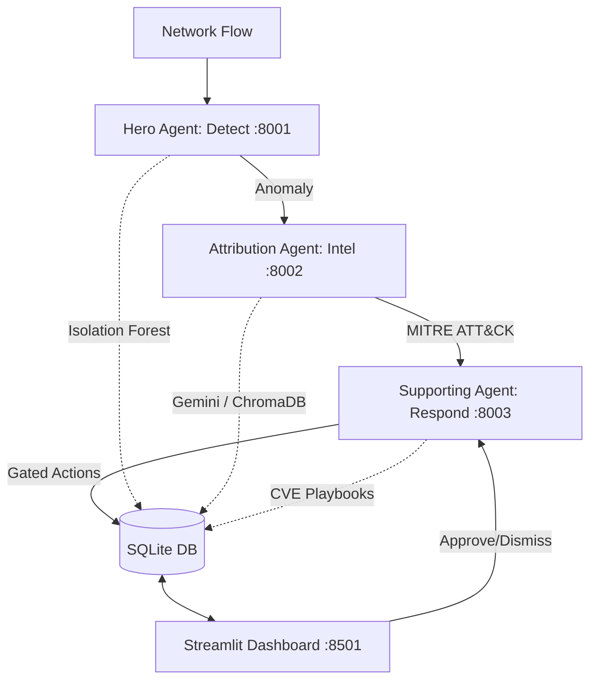

# SentinelGrid — Cyber Resilience Platform

[](#)
[](#)
[](#)
[](#)
[](#)

Autonomous multi-agent threat detection, semantic MITRE ATT&CK attribution, and gated incident response.

## Overview

Enterprise digital infrastructures are subject to increasingly complex, high-velocity cybersecurity threats.
Traditional security systems rely heavily on static, signature-based rules, which fail against novel zero-day attacks.
When anomalies are detected, SOC analysts are often overwhelmed by alerts that lack semantic threat context.
SentinelMind AI is an autonomous, agent-based platform designed to defend enterprise networks.
It ingests raw network connection flows and classifies anomalies using an Isolation Forest ML model.
It then semantically maps detected threats to known MITRE ATT&CK techniques using ChromaDB vector search.
High-fidelity alerts are validated using Google's Gemini 1.5 Flash LLM for cognitive confirmation.
A third agent assesses asset vulnerability and CVE profiles to prioritize response playbooks.
Critical containment actions (e.g., endpoint isolation) are queued for human-in-the-loop validation.
This workflow ensures robust cyber resilience while preventing unauthorized automated disruption.
All activities are recorded in a secure SQLite database and audited in an append-only transaction log.
Security analysts monitor the operations and approve/reject responses via an interactive Streamlit UI.

## Features

* **Machine Learning Anomaly Detection**: Employs an Isolation Forest model to detect outliers.
* **Feature Statistical Profiling**: Flags abnormal fields using dynamical Z-score statistical limits.
* **MITRE ATT&CK Translation**: Translates raw metrics to natural language for vector similarity search.
* **Dual Threat Classification**: Validates candidate techniques using Gemini or local ChromaDB fallback.
* **Contextual Risk Prioritization**: Computes risk score based on anomaly, asset weight, and active CVEs.
* **Gated Human-in-the-Loop approval**: Pauses high-risk mitigation actions until explicit analyst sign-off.
* **Append-Only Auditing**: Logs detailed execution steps for every agent run into alert audit trails.
* **Active Replay Simulator**: Streams historical NSL-KDD flows to test detection and attribution.
* **Responsive Streamlit SOC**: Dark-theme console with real-time refresh, metric cards, and charts.
* **Robust Integrity Verification**: Verifies trained model weights on startup via SHA-256 validation.
* **Microservice Architecture**: Implements decoupled FastAPI agents communicating via JSON schemas.
* **Comprehensive Test Suite**: Includes integration tests verifying schema validation and API flows.

## Architecture

The platform employs a microservice structure of three cooperative FastAPI agents, a database, and Streamlit SOC.



* **Hero Agent**: Classifies traffic flows into normal or anomalous, calculating outlier feature scores.
* **Attribution Agent**: Searches ChromaDB for semantic mappings and validates using Gemini LLM.
* **Supporting Agent**: Selects playbooks according to asset criticalities and active vulnerability profiles.
* **Database (SQLite)**: Stores alerts and audit trials centrally to maintain the shared state.
* **SOC Console**: Streamlit dashboard that visualizes active alerts and serves as the manual approval gate.
* **JSON Schema**: Strict data contract defining required alert fields shared across the entire pipeline.
* **Data Flow**: Sequential API calls that enrich network packet data from detection to final remediation.

## Project Structure

```text
cyber-resilience/
├── evaluation/              # Scripts to evaluate detection & attribution accuracy
├── src/
│   ├── attribution_agent/   # MITRE index generation and semantic threat API
│   ├── common/              # Schema validator, deck generator, mock generator
│   ├── dashboard/           # Streamlit SOC interface source file
│   ├── hero_agent/          # Isolation Forest training and inference detect API
│   ├── integration/         # Ingestion pipeline and flow replay simulator
│   └── supporting_agent/    # Asset inventories, playbooks, response API
└── tests/                   # Unit and integration test suites
```

## Installation

Install dependencies and prepare the python virtual environment:

```bash
# Clone repository
git clone https://github.com/SuryaX096/Cyber-resilience.git
cd Cyber-resilience

# Create virtual environment
python -m venv .venv

# Activate virtual environment (Windows)
.venv\Scripts\Activate.ps1

# Install required libraries
pip install --upgrade pip
pip install -r requirements.txt
```

## Run Project

Execute these commands sequentially to prepare and run the multi-agent system:

```bash
# 1. Download data and train model
python -m src.hero_agent.data_prep && python -m src.hero_agent.train_model

# 2. Build ChromaDB semantic vector index
python -m src.attribution_agent.build_mitre_index

# 3. Start APIs (detect: 8001, attribute: 8002, respond: 8003)
python -m src.hero_agent.detect_api
python -m src.attribution_agent.attribute_api
python -m src.supporting_agent.respond_api

# 4. Run dashboard & simulator
streamlit run src/dashboard/app.py
python -m src.integration.replay_demo --count 30 --interval 1.5
```

## Dashboard Preview

Key operational and detection metrics are highlighted directly on the SOC dashboard:

* **Detection Metrics**: Precision: `95.8%`, Recall: `74.5%`, F1-Score: `83.8%`, FPR: `4.29%`, Accuracy: `95.7%`
* **Response Metrics**: Mean Time to Detect (MTTD): `<1s`, Mean Time to Respond (MTTR): `<5s`
* **Performance Logs**: Inference Latency: `~12ms`, Dashboard Auto-Refresh Rate: `3s`
* **Real-time Interface**: Pulse alerts feed, pending approval alerts, and threat attribution map.
* **Interactive Gate**: Enables manual overrides, logs audit trails, and triggers CMDB blocks.

## API Endpoints Table

| Method | Endpoint | Port | Description |
|---|---|---|---|
| `POST` | `/detect` | 8001 | Classifies incoming traffic flows into anomalous or normal. |
| `POST` | `/attribute` | 8002 | Semantically attributes features to MITRE ATT&CK using vector db. |
| `POST` | `/respond` | 8003 | Selects mitigation playbooks based on asset profiles and CVEs. |
| `POST` | `/approve` | 8003 | Manual approval override for gated containment playbooks. |

All endpoints ingest JSON payloads validated by standard models and log audits.
Service communication occurs internally before committing transactions to SQLite.
API routes allow easy integration of external feeds, log processors, and monitors.
Each agent supports direct REST queries with detailed schemas.
Validation errors return standardized HTTP 422 errors detailing schemas.

## Tech Stack

* **Frameworks**: Python, FastAPI, and Streamlit.
* **Machine Learning**: Scikit-Learn (Isolation Forest).
* **Semantic Search**: ChromaDB (Vector Store), Sentence-Transformers.
* **LLM Engine**: Google Gemini 1.5 Flash (via Gemini API).
* **Database**: SQLite (Central alert repository & audits).
* **Validation**: Pydantic v2 (Strict Schema Validation).
* **Development**: Pytest (Unit and pipeline integration tests).

## Future Work

* **Ingestion Scaling**: Integrate Apache Kafka / RabbitMQ message brokers.
* **ML Explainability**: Embed SHAP and LIME visual explanation plots.
* **Active CMDB Integration**: Synchronize inventory dynamically with AWS and VMware.
* **Automated Rollbacks**: Enable automatic rule reverts on false positive containment.
* **SIEM Exporting**: Support exporting alerts directly to Splunk or Elastic.
* **Multi-model Ensembles**: Combine Isolation Forest with Autoencoders and XGBoost.
* **Continuous Re-training**: Trigger model rebuilds dynamically on feedback loops.

## License

This project is licensed under the MIT License.
See the [LICENSE](LICENSE) file for the full text.
